# checkmark

Checkmark is a CLI tool designed to streamline your Markdown workflow. It provides a suite of features including auto-formatting, linting, AI-assisted document review, link checking, spell checking, and AI-assisted document composition.



[Feature](#features)

## Features

Checkmark is a tool designed to help maintain high-quality Markdown documentation. It offers a range of commands to automate various tasks related to formatting, checking, and reviewing Markdown files:

- **fmt**: Auto-formats all Markdown files in the project, fixing common formatting issues such as trailing whitespace and inconsistent line endings.
- **links**: Check broken links in your documents, covering both web and local file links.
- **lint**: Runs a linter (partial port of [markdownlint](https://github.com/DavidAnson/markdownlint)) to ensure your Markdown files adhere to best practices.
- **review**: Uses OpenAI's API to review your documents, providing AI-assisted insights and suggestions. Requires OpenAI API key.
- **compose**: Assists in composing new Markdown documents from a prompt in a context of an existing document. Powered by OpenAI. Requires OpenAI API key.
- **spelling**: Check your documents for spelling errors.
- **remote check**: Check documents from the remote Git repository.
- **CI mode**: Turns off interactive prompts and outputs reports in a format suitable for CI/CD pipelines.

## Installation

Make sure you install the latest [Cargo](https://doc.rust-lang.org/cargo/getting-started/installation.html) version. If you are using Windows, ensure that Perl is installed and added to the system's `PATH`. You may consider using [Strawberry Perl](https://strawberryperl.com) for this purpose. Next, run the following command:

```sh
cargo install --git https://github.com/vvvar/checkmark.git
```

> **NOTE**: Pre-built as well as installation from crates.io is planned

You can verify the installation with the following command:

```sh
checkmark --version
```

## Getting started

Checkmark has a bunch of different commands. Each serves its purpose. Below you will find descriptions of all available commands.

### `fmt`

Recursively auto-format all Markdown files inside the current directory with:

```sh
checkmark fmt .
```

Verify that all Markdown files have been formatted with:

```sh
checkmark fmt . --check
```

Additionally, you can print a diff to see what exactly will be re-formatted:

```sh
checkmark fmt . --check --show-diff
```

Run this command to see a full list of formatting options:

```sh
checkmark fmt --help
```

### `review`

`checkmark` is capable of reviewing your documentation using [Open AI](https://openai.com). First, you need to provide an OpenAI API Key. You can do it either via environment variable:

```sh
export OPEN_AI_API_KEY=<YOUR_API_KEY>
```

or by creating a `.env` file with it(see [this](https://github.com/motdotla/dotenv) if you're not familiar). See [here](https://openai.com/blog/openai-api) how to find an API key.

They, you can recursively review all your Markdown documents with:

```sh
checkmark review .
```

This will:

1. take all your Markdown files
2. split them in chunks (by headings)
3. one by one send them to Open.AI for review with the following prompt:
   > Review this project documentation for grammar, readability and clarity of the content.
   > Provide a summary and improvement suggestions.
   > Each suggestion should identify the issue, its location, and a proposed fix.
   > Each suggestion should have 'description', 'original', and 'replacement'
4. collect results and show them to you in the form of suggestions. For example:

    ```txt
    note[Review]: Add a brief description for each command to provide more context for users.
      ┌─ /Users/vvoinov/Documents/repos/md-checker/README.md:14:1
      │
    14 │ - **spelling**: Check your documents for spelling errors.
      │ ^^^^^^^^^^^^^^^^^^^^^^^^^^^^^^^^^^^^^^^^^^^^^^^^^^^^^^^^^
      │
      = Consider following change: 
        - **spelling**: Checks documents for spelling errors.
    
    note[Review]: Consider adding a brief explanation of the CI mode and its purpose.
      ┌─ /Users/vvoinov/Documents/repos/md-checker/README.md:15:1
      │
    15 │ - **CI mode**: Turns off interactive prompts and outputs reports in a format suitable for CI/CD pipelines.
      │ ^^^^^^^^^^^^^^^^^^^^^^^^^^^^^^^^^^^^^^^^^^^^^^^^^^^^^^^^^^^^^^^^^^^^^^^^^^^^^^^^^^^^^^^^^^^^^^^^^^^^^^^^^^
      │
      = Consider following change: 
        - **CI mode**: Turns off interactive prompts and outputs reports in a format suitable for CI/CD pipelines. This mode is designed to facilitate integration with CI/CD processes.
    ```

You can control the level of creativity of the AI with (values between 0 and 100 are accepted):

```sh
checkmark review . --creativity 80
```

You can provide a custom prompt for Open.AI with:

```sh
checkmark review . --prompt "Review grammar"
```

Run this command to see a full list of review options:

```sh
checkmark review --help
```

### `compose`

`checkmark` is capable of composing documentation using [Open.AI](https://openai.com) based on your prompts with:

```sh
checkmark compose --prompt "Write me a dummy documentation" --output DOCUMENT.MD
```

This will generate a file `DOCUMENT.MD` with content generated, using your prompt.

You can control the level of creativity of an AI with(values between 0 and 100 are accepted):

```sh
checkmark review . --creativity 80
```

Additionally, you can provide a file and ask `checkmark` to use it as an additional context for your prompt. For example:

```sh
checkmark compose --context README.md --prompt "Re-write this file in a manner of pirates" --output DOCUMENT.MD
```

This will take `README.md`, rewrite it using your prompt and store it in `DOCUMENT.MD`.

Run this command to see a full list of review options:

```sh
checkmark compose --help
```

### `linkcheck`

Recursively check all links in Markdown files inside the current directory with:

```sh
checkmark linkcheck .
```

This will extract all hyperlinks, file links(for e.x. `\[File\]\(./image.png\)`), and e-mails and check whether they are reachable or not.
If you want to ignore some links, use:

```sh
checkmark linkcheck . --ignore-wildcards "**example.com**"
```

This will tell the `checkmark` to avoid checking all links that match a `**example.com**` pattern. You can use this to ignore files as well.

Run this command to see a full list of link checker options:

```sh
checkmark linkcheck --help
```

### `lint`

Recursively lint all Markdown files inside the current directory with:

```sh
checkmark lint .
```

This will test all your files against linting rules. Linting rules are ported from [markdownlint](https://github.com/DavidAnson/markdownlint)(work in progress).

Run this command to see a full list of linter options:

```sh
checkmark lint --help
```

### `spellcheck`

Recursively spell-check all Markdown files inside the current directory with:

```sh
checkmark spellcheck .
```

This will check all Markdown files for spelling errors. If you need to white-list words:

```sh
checkmark spellcheck . --words-whitelist checkmark,OPEN_AI_API_KEY
```

This will not print spelling errors for the words "checkmark" and "OPEN_AI_API_KEY" anymore.

Run this command to see a full list of review options:

```sh
checkmark spellcheck --help
```

### `generate-config`

`checkmark` can be controlled via CLI and config file. Although it is completely fine to use CLI, when setting up a `checkmark` in a project it is useful to have all settings under version control. `checkmark` has a command that can generate a default config file for you:

```sh
checkmark generate-config
```

Executing this command will generate a file named `checkmark.toml` in the current directory. The generated `checkmark.toml` file contains a full list of options with their default values. Each configuration option has documentation that describes how to use it. You can modify it to suit your requirements. You can store this file in the following folders(lookup will be done exactly in this order, the first match is picked up):

1. project root
2. `config`
3. `conf`
4. `cfg`
5. `.github`

In these folders, `checkmark` will look for either a file called `checkmark.toml` or `.checkmark.toml`. Choose the location and name that fits best your needs. If none of these locations or names fits you, then you can provide a path to your config file via the command line:

```sh
checkmark <command> --config "/path/to/your/config.toml"
```

### Remote check

You can perform any check mentioned above on a remote Git repository. For that, provide link to the remote Git repo instead of a local file path like this:

```sh
checkmark fmt --check https://github.com/vvvar/checkmark.git
```

Or use SSH:

```sh
checkmark fmt --check git@github.com:vvvar/checkmark.git
```

> **NOTE**: checkmark will try to use your existing SSH keys in the default location (`~/.ssh`). If you're having problems ensure that you can do a normal clone using your local git client.

## Contributing

For information about contribution, please refer to the [CONTRIBUTING.md](./docs/CONTRIBUTING.md) file.

## Support

For support information, please refer to the [SUPPORT.md](./docs/SUPPORT.md) file.
