# List of pre-build themes for `render` command

This documents lists all available themes supported by `render` command.

## `book`

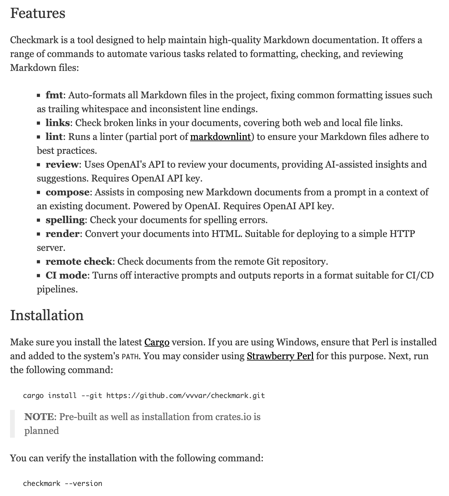

## `classic`

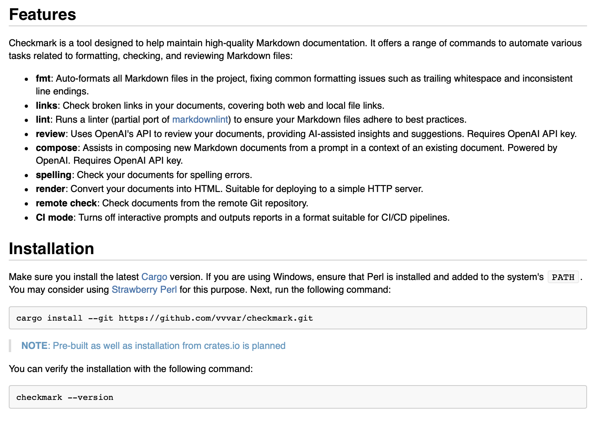

## `funk`

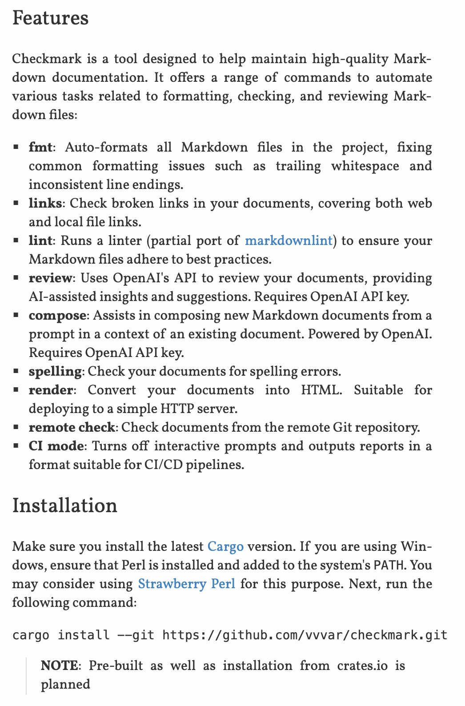

## `gfm`

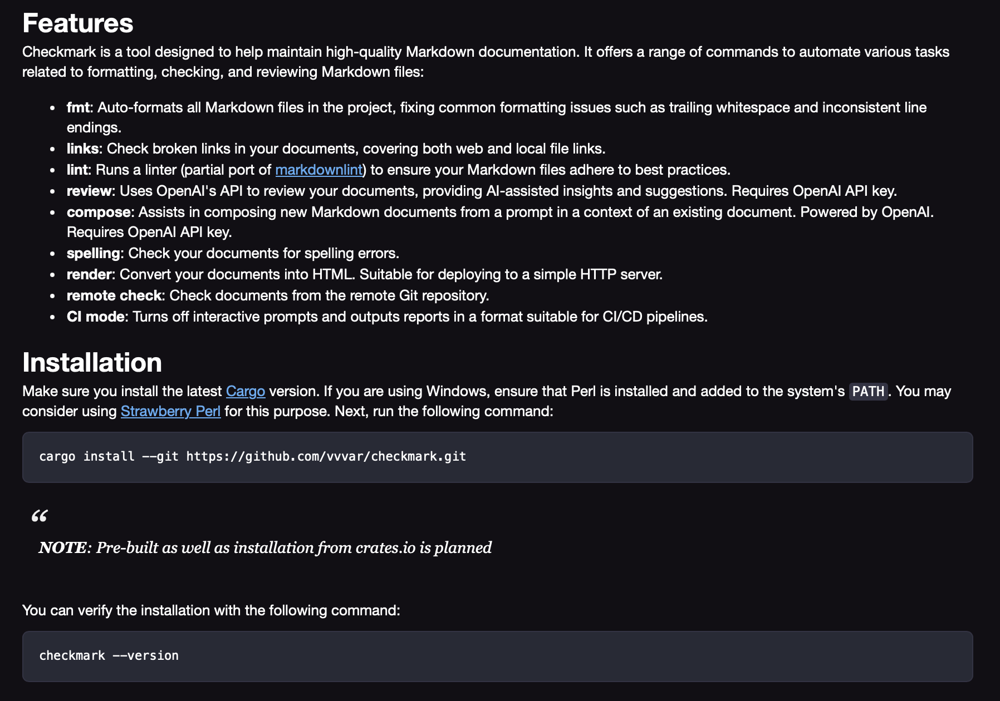

## `grayscale`

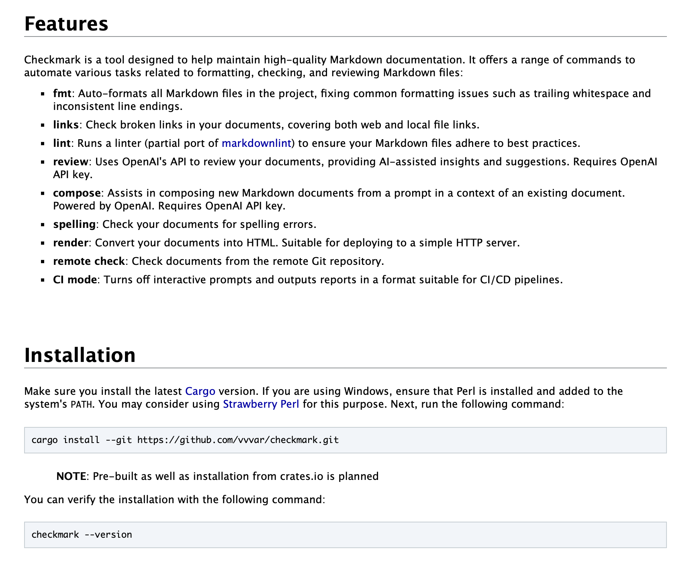

## `newspaper`

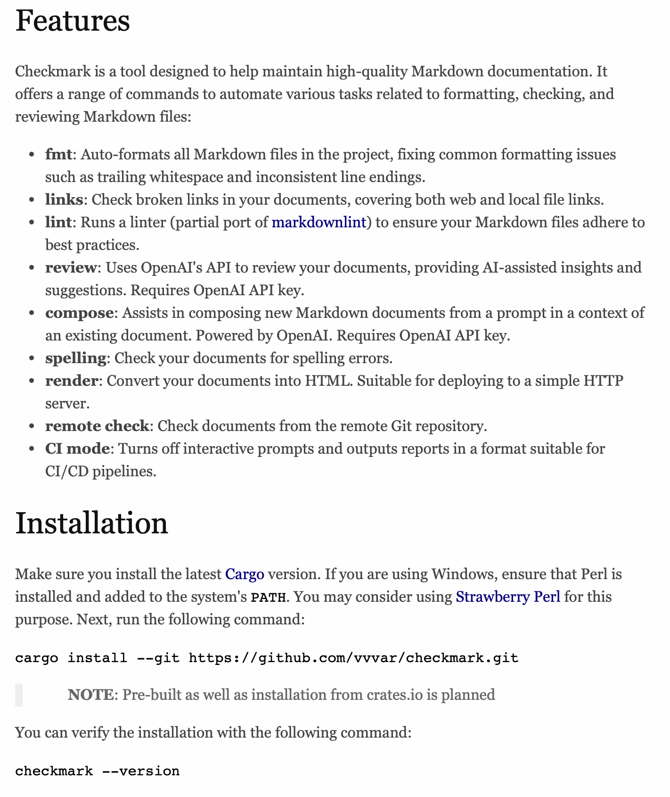

## `paper`

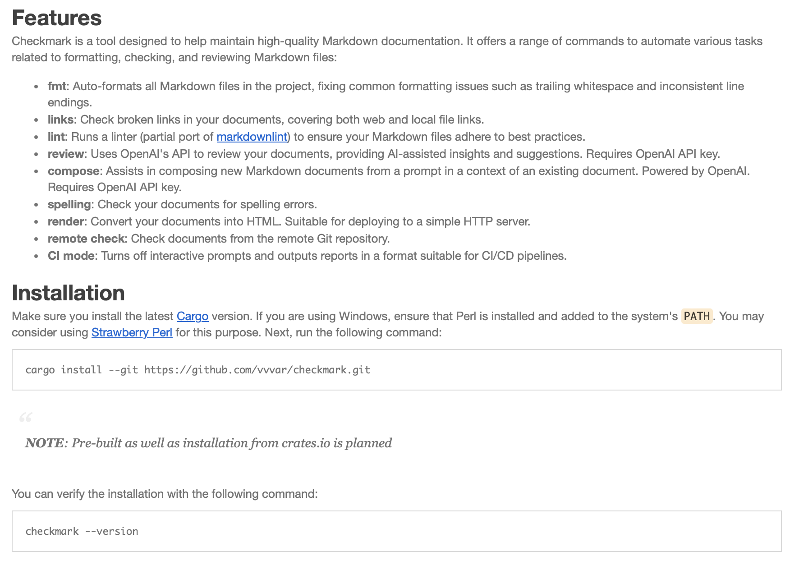

## `publication`

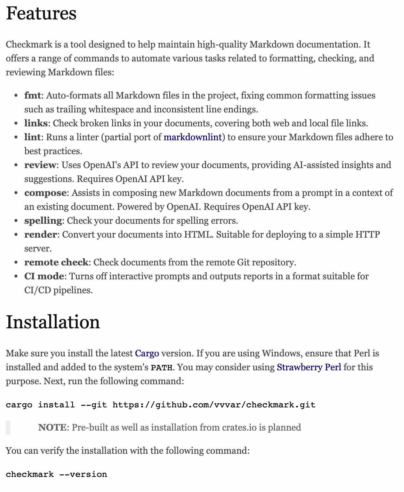

## `space`

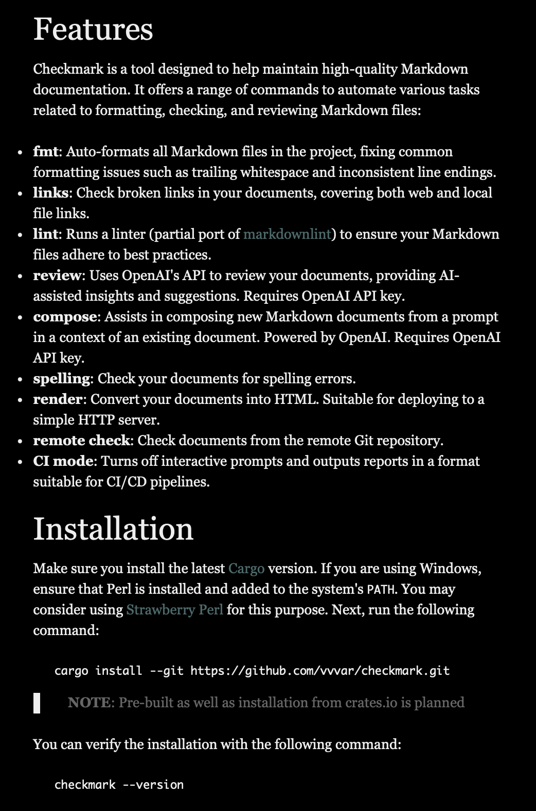

## `tiny`

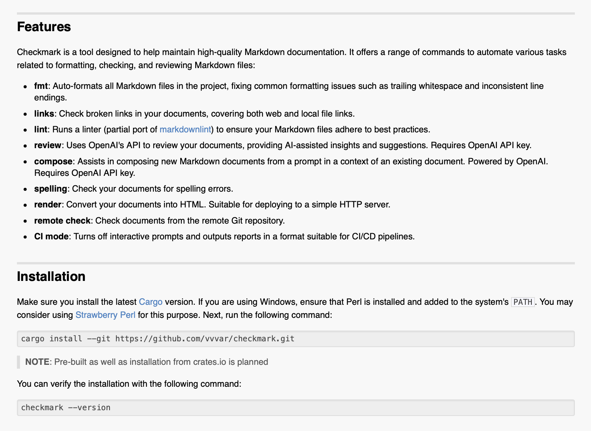

## `typewriter`

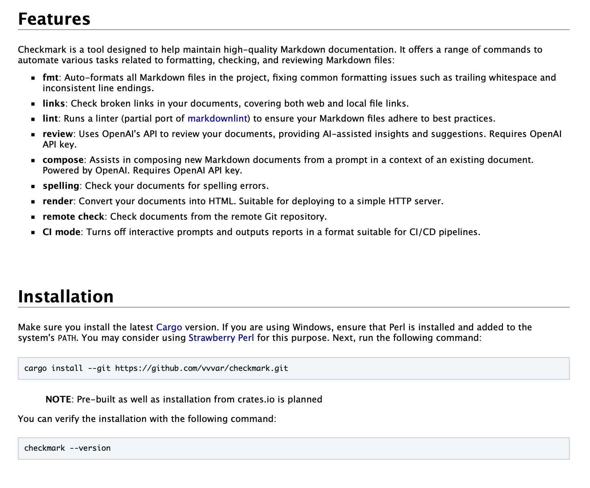

## `whiteboard`

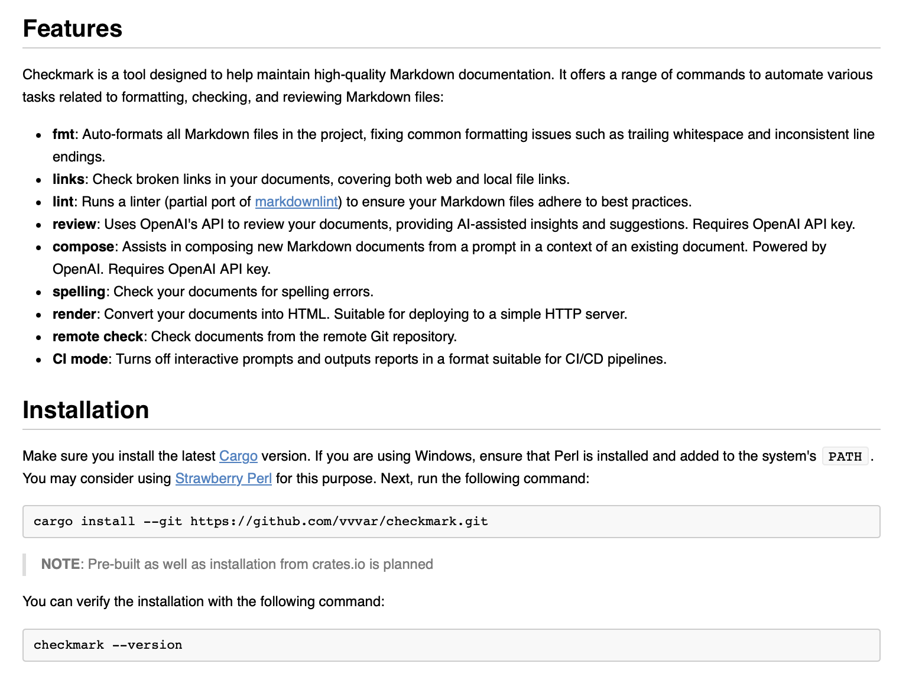
